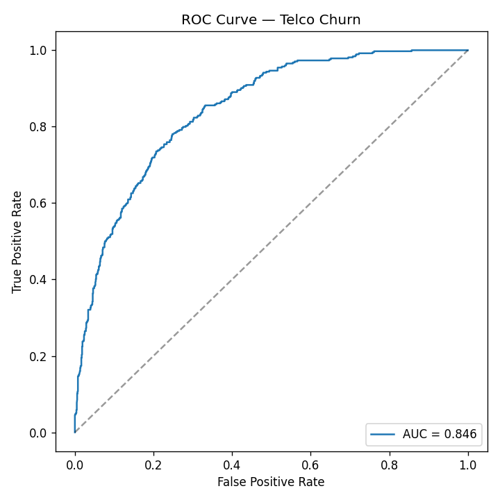

# Telco Churn Prediction — MLOps Service


End-to-end ML-сервис для прогнозирования оттока телеком-клиентов: от обучения модели до деплоя в продакшен с CI/CD и мониторингом.

**Live demo:** https://telco-churn-mlops-srw3.onrender.com/docs

---

## Содержание

- [Архитектура](#архитектура)
- [Метрики модели](#метрики-модели)
- [Стек](#стек)
- [Быстрый старт](#быстрый-старт)
- [API](#api)
- [Docker](#docker)
- [Тесты](#тесты)
- [CI/CD](#cicd)
- [Мониторинг](#мониторинг)
- [Структура проекта](#структура-проекта)

---

## Архитектура

```
                        ┌─────────────────────────┐
                        │   Telco Customer Churn  │
                        │   (Kaggle / IBM)        │
                        └────────────┬────────────┘
                                     │
                                     ▼
                        ┌─────────────────────────┐
                        │  EDA + preprocessing    │
                        │  (notebooks/01_eda)     │
                        └────────────┬────────────┘
                                     │
                                     ▼
                        ┌─────────────────────────┐
                        │  train.py               │
                        │  ├─ LogisticRegression  │
                        │  └─ CatBoost            │
                        │  → best by ROC-AUC      │
                        └────────────┬────────────┘
                                     │
                                     ▼
                        ┌─────────────────────────┐
                        │  model/churn_model.pkl  │
                        │  model/metrics.json     │
                        └────────────┬────────────┘
                                     │
                                     ▼
   ┌──────────────┐        ┌─────────────────────────┐        ┌──────────────┐
   │   Client     │ ─────► │  FastAPI                │ ─────► │  Prometheus  │
   │  (curl,      │        │  ├─ /health             │        │  /metrics    │
   │   Swagger)   │ ◄───── │  ├─ /model-info         │        └──────────────┘
   └──────────────┘        │  ├─ /predict            │
                           │  └─ /metrics            │
                           └────────────┬────────────┘
                                        │
                                        ▼
                           ┌─────────────────────────┐
                           │  Docker + Compose       │
                           │  GitHub Actions (CI)    │
                           │  Render (CD)            │
                           └─────────────────────────┘
```

## Метрики модели

| Модель | ROC-AUC | F1 | Комментарий |
|---|---:|---:|---|
| LogisticRegression | 0.84 | 0.61 | Baseline, интерпретируемая |
| **CatBoost** | **0.85** | **0.63** | **Выбрана как лучшая** |

Дисбаланс классов: 73% No / 27% Yes. Использованы `class_weight="balanced"` и ROC-AUC как основная метрика.

Полный отчёт: [`model/metrics.json`](model/metrics.json)

ROC-кривая: 

## Стек

**ML / Data**
- Python 3.10, Pandas, NumPy
- Scikit-learn, CatBoost, XGBoost
- Matplotlib, Seaborn

**API / Backend**
- FastAPI, Pydantic, Uvicorn
- REST API, JSON

**MLOps**
- Docker, docker-compose
- GitHub Actions (CI)
- Render (CD, live demo)
- Prometheus-метрики
- pytest, ruff
- UptimeRobot (external monitoring)

## Быстрый старт

```bash
git clone https://github.com/SiniauskiArtsiom/telco-churn-mlops.git
cd telco-churn-mlops
python -m venv .venv && source .venv/bin/activate
pip install -r requirements.txt

# Обучение (опционально — модель уже закоммичена)
python train.py

# Запуск API
uvicorn app.main:app --reload
```

Открыть:
- Swagger UI: http://localhost:8000/docs
- ReDoc: http://localhost:8000/redoc
- Health: http://localhost:8000/health

## API

| Метод | Путь | Описание | Пример |
|---|---|---|---|
| GET | `/health` | Статус сервиса | `curl /health` |
| GET | `/model-info` | Информация о модели | `curl /model-info` |
| POST | `/predict` | Вероятность оттока | см. ниже |
| GET | `/metrics` | Prometheus-метрики | `curl /metrics` |

### Пример запроса

```bash
curl -X POST https://telco-churn-api.onrender.com/predict \
  -H "Content-Type: application/json" \
  -d '{
    "gender": "Female",
    "SeniorCitizen": 0,
    "Partner": "Yes",
    "Dependents": "No",
    "tenure": 1,
    "PhoneService": "No",
    "MultipleLines": "No phone service",
    "InternetService": "DSL",
    "OnlineSecurity": "No",
    "OnlineBackup": "Yes",
    "DeviceProtection": "No",
    "TechSupport": "No",
    "StreamingTV": "No",
    "StreamingMovies": "No",
    "Contract": "Month-to-month",
    "PaperlessBilling": "Yes",
    "PaymentMethod": "Electronic check",
    "MonthlyCharges": 29.85,
    "TotalCharges": 29.85
  }'
```

Ответ:

```json
{
  "churn_probability": 0.7321,
  "churn_prediction": true,
  "threshold": 0.5,
  "model_name": "CatBoostClassifier"
}
```

Валидация входа через Pydantic: некорректные значения (например, `tenure: -5`) возвращают `422`.

## Docker

```bash
# Сборка и запуск
docker compose up --build -d

# Проверка
curl http://localhost:8000/health

# Логи
docker compose logs -f api

# Остановка
docker compose down
```

Healthcheck встроен: контейнер становится `(healthy)` через ~30 секунд.

## Тесты

```bash
pytest          # 12 тестов
ruff check .    # линтер
```

Покрытие:
- API-эндпоинты (`/health`, `/model-info`, `/predict`, `/metrics`)
- Валидация Pydantic (negative tenure, неверная категория, missing field)
- Препроцессинг (`clean_raw`, `split_features_target`, `build_preprocessor`)

## CI/CD

**CI (GitHub Actions):** при каждом push в `main`
1. `ruff check .`
2. `pytest`
3. `docker build`

**CD (Render):** авто-деплой из `main` → https://telco-churn-mlops-srw3.onrender.com

## Мониторинг

- **Prometheus** `/metrics` — счётчики запросов, латентность
- **Render Dashboard** — CPU, memory, request rate, error rate
- **UptimeRobot** — пинг `/health` каждые 5 минут
- **Логи** — структурированные, с латентностью каждого предсказания

## Структура проекта

```
telco-churn-mlops/
├── app/
│   ├── main.py          # FastAPI приложение
│   ├── model.py         # загрузка модели, инференс
│   ├── preprocess.py    # препроцессинг, ColumnTransformer
│   └── schemas.py       # Pydantic-схемы
├── model/
│   ├── churn_model.pkl  # обученная модель
│   └── metrics.json     # метрики LogReg и CatBoost
├── notebooks/
│   ├── 01_eda.ipynb     # EDA
│   └── figures/         # графики
├── scripts/
│   ├── plot_roc.py      # ROC-кривая
│   ├── smoke_test.py    # проверка live API
│   └── drift_check.py   # (задел на будущее)
├── tests/               # pytest
├── .github/workflows/   # CI
├── Dockerfile
├── docker-compose.yml
├── train.py
├── requirements.txt
└── README.md
```

## Что дальше

- [ ] Мониторинг дрейфа данных (PSI/KS по фичам)
- [ ] MLflow для версионирования моделей
- [ ] A/B-тест двух моделей в продакшене
- [ ] Батч-предсказания через очередь (Celery + Redis)

## Лицензия

MIT

## Автор

**Artsiom Siniauski**
- GitHub: https://github.com/SiniauskiArtsiom
- Email: artsiomsiniauski@gmail.com
